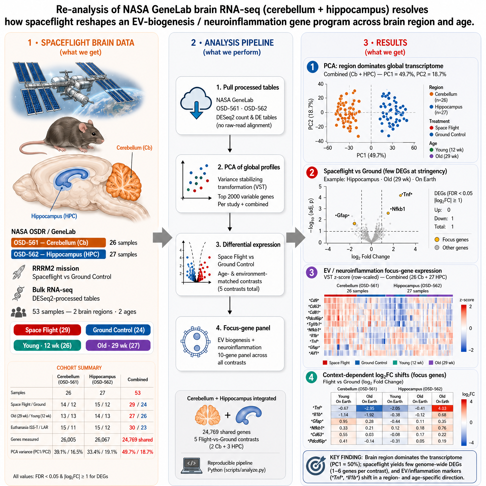
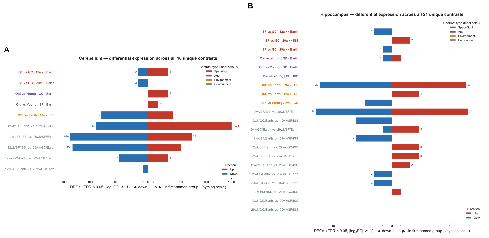
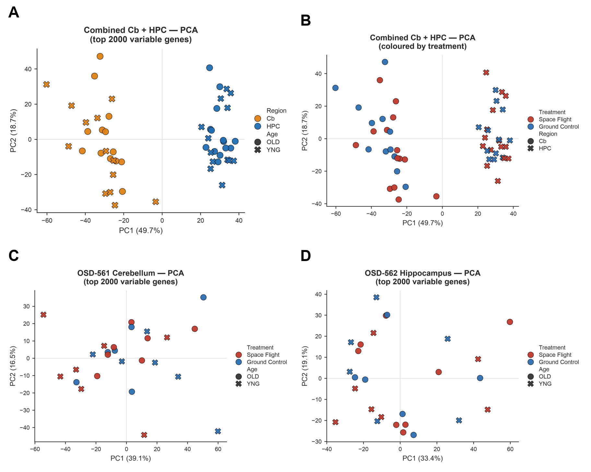
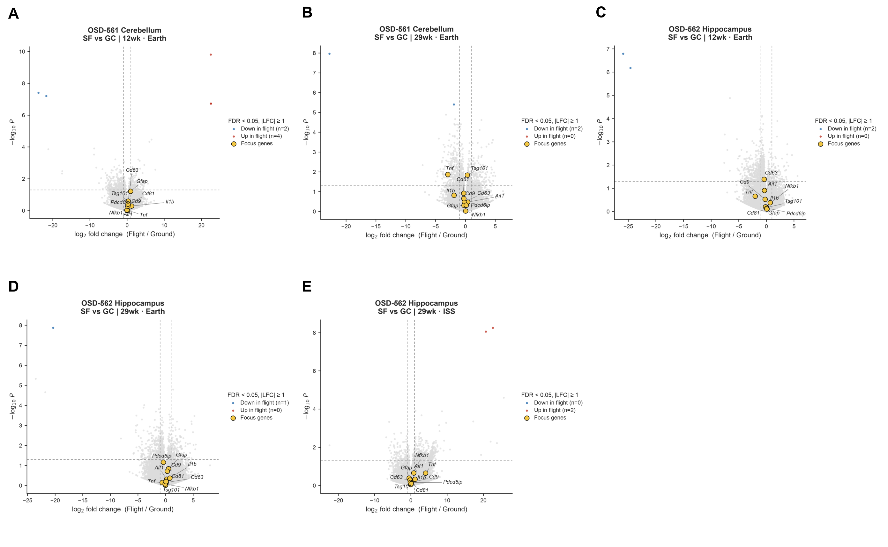
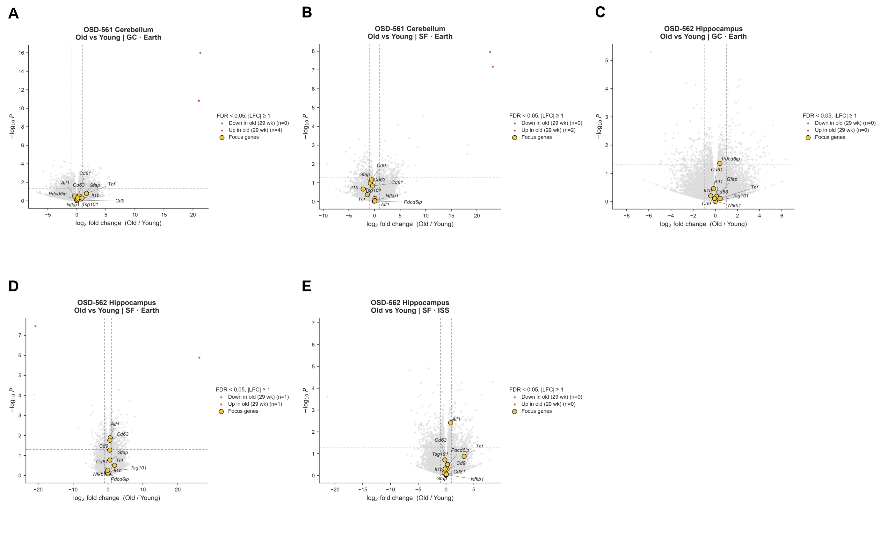
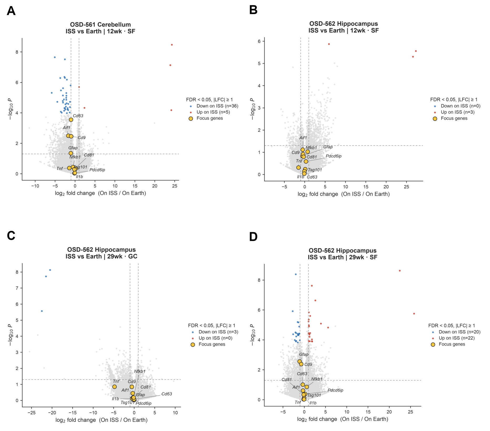
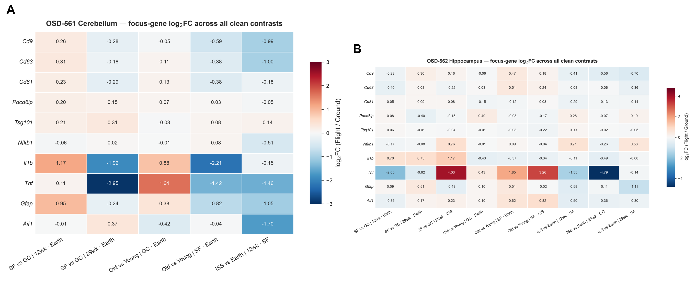
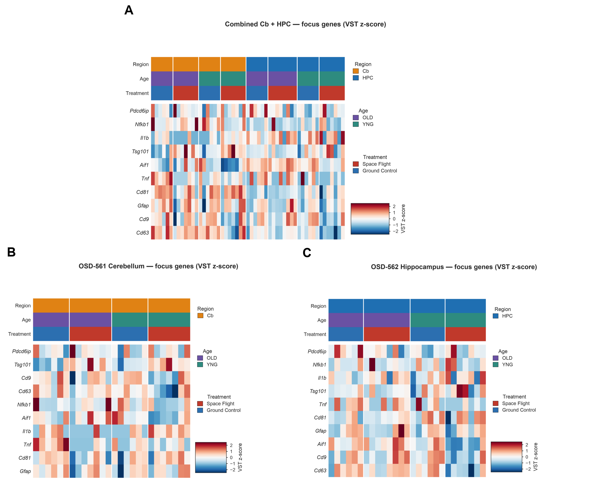
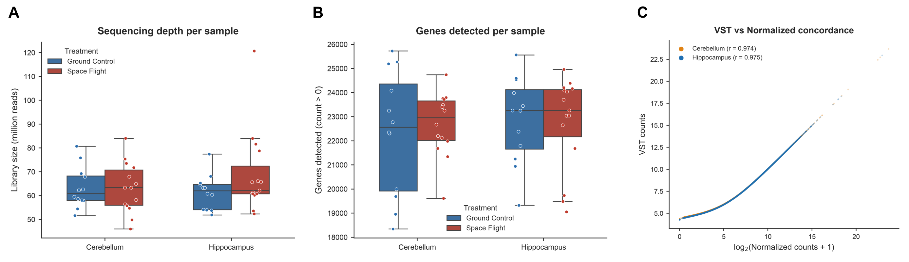

# Spaceflight Transcriptomics of the Mouse Brain — OSD-561, 562, 682, 685, 698, 699

Reproducible re-analyses of **six** NASA Open Science Data Repository (OSDR)
datasets covering the mouse brain under spaceflight, sharing one CNS-injury /
extracellular-vesicle (EV) mRNA target panel.

| Arm | Datasets | Assay | Regions | Analysis |
|---|---|---|---|---|
| **Bulk RNA-seq** | OSD-561, OSD-562 | GeneLab bulk RNA-seq (RRRM-2) | Cerebellum, hippocampus | this directory |
| **Spatial** | OSD-682, OSD-685, OSD-698, OSD-699 | NanoString GeoMx DSP | CA1, dentate gyrus, frontal cortex, cerebral cortex | [`OSD-682-685-698-699-brain-spatial/`](OSD-682-685-698-699-brain-spatial) |

The shared target panel lives in
[`config/cns_ev_targets_mouse_symbols.txt`](config/cns_ev_targets_mouse_symbols.txt)
(147 mouse symbols) with its full mapping audit in
[`config/cns_ev_targets_mapped.csv`](config/cns_ev_targets_mapped.csv). See
[CNS / EV target panel](#cns--ev-target-panel) for the six source-data
corrections it required, and
[Companion spatial analysis](#companion-spatial-analysis-osd-682685698699) for
the spatial findings.

The two arms are deliberately kept as separate pipelines: they are different
assays with different statistics, different power, and different data sources
(OSDR hosts processed tables for the bulk datasets, but only raw FASTQ for the
spatial ones, whose processed layer comes from GEO).

> Every unique comparison in the differential-expression tables is analysed and
> categorised (Spaceflight / Age / Environment / Confounded) — not just the
> spaceflight contrasts — and every downloaded table is used.

<p align="center">
  
</p>

---

## Overview

This repository takes the GeneLab-processed bulk RNA-seq tables for two brain
regions flown on the ISS, and produces a complete, honest analysis:

- **Global structure** — PCA on variance-stabilised counts (all samples, all genes).
- **Differential expression** — every unique group comparison in the DE tables,
  categorised by which experimental factor differs.
- **Focus-gene panel** — an EV-biogenesis + neuroinflammation gene set tracked
  across all clean contrasts.
- **Quality control** — sequencing depth, genes detected, and count-table
  concordance, built from the raw (RSEM) and normalized count tables.

All figures are journal-styled (Arial, embedded fonts, no overlapping labels) and
composed into eight multi-panel figures. All results are exported to CSV and a
single Excel workbook.

## Key result

The dominant axis of transcriptional change is **not** the Flight-vs-Ground
(Spaceflight) contrast. When all comparisons are analysed, the **On-ISS vs
On-Earth (Environment)** axis drives far more differential expression, while the
clean spaceflight effect is small.

| Region | Spaceflight (Flight vs Ground) | Environment (On ISS vs On Earth) |
|---|---|---|
| Cerebellum (OSD-561) | 2–6 DEGs | **41** (36 down, 5 up) |
| Hippocampus (OSD-562) | 1–2 DEGs | **42** (22 up, 20 down) |

The largest gene counts come from **confounded** contrasts (up to 1,081 DEGs in
cerebellum) that mix two or more factors; these are reported for completeness but
are flagged as not cleanly interpretable. Thresholds: FDR < 0.05 and
|log2 fold change| ≥ 1.

<p align="center">
  
</p>

## Datasets

| OSD | GLDS | Region | Samples | Genes measured |
|---|---|---|---|---|
| [OSD-561](https://osdr.nasa.gov/bio/repo/data/studies/OSD-561) | GLDS-556 | Cerebellum | 26 | 26,005 |
| [OSD-562](https://osdr.nasa.gov/bio/repo/data/studies/OSD-562) | GLDS-557 | Hippocampus | 27 | 26,067 |
| Combined | — | Cb + HPC | 53 | 24,769 shared |

Design factors per sample: **age** (12 vs 29 week), **treatment**
(Ground Control vs Space Flight), and **environment / collection condition**
(On Earth vs On ISS). Cohort composition (combined): 29 Space Flight / 24 Ground
Control, 27 old / 26 young, 30 ISS-terminal / 23 live-animal-return.

Only the small GeneLab-processed tables are used (a few MB each) — **not** the
raw FASTQ/BAM (hundreds of GB) and **not** the spatial-transcriptomics layer.

## Repository structure

```
.
├── README.md
├── Makefile                      # one-command pipeline
├── requirements.txt              # pinned dependencies (Python 3.12)
├── config/
│   ├── focus_genes.txt           # panel used for the figures currently in results/
│   ├── cns_ev_targets_mouse_symbols.txt   # finalised CNS/EV panel, 147 mouse symbols
│   └── cns_ev_targets_mapped.csv          # human ENSID -> mouse ortholog audit trail
├── OSD-682-685-698-699-brain-spatial/     # companion GeoMx DSP analysis
├── scripts/
│   ├── download_data.py          # fetch GeneLab tables from NASA OSDR
│   ├── analyze.py                # PCA, spaceflight volcanoes, focus heatmaps, contrast helpers
│   ├── analyze_full.py           # DEG landscape, all clean-contrast volcanoes, focus log2FC, QC
│   ├── export_results.py         # all result tables -> CSV + Excel
│   ├── make_panels.py            # compose multi-panel figures
│   └── dataset_summary.py        # dataset overview (md + json)
├── data/                         # gitignored — regenerate with download_data.py (~196 MB)
│   ├── OSD-561/
│   └── OSD-562/
└── results/
    ├── figures/
    │   ├── panels/               # Figure1–Figure8 (PDF + PNG) — the main deliverables
    │   └── *.pdf / *.png         # individual source figures
    ├── tables/
    │   ├── OSD-561_562_results.xlsx   # consolidated workbook (all summary sheets)
    │   ├── all_contrasts_DEG_summary.csv
    │   ├── dataset_summary.{md,json}
    │   └── csv/                  # per-table CSVs (large DE_*.csv are gitignored)
    └── graphical_abstract/
        ├── graphical_abstract.svg
        └── graphical_abstract.png
```

## Requirements

- Python 3.12 (tested on 3.12.13)
- Dependencies pinned in [`requirements.txt`](requirements.txt): pandas, numpy,
  matplotlib, seaborn, scikit-learn, scipy, adjustText, openpyxl.

## Quick start

```bash
# 1. Environment + dependencies
make setup                      # creates .venv and installs requirements.txt

# 2. Download the GeneLab tables from NASA OSDR (~196 MB)
make data

# 3. Run everything: analysis -> panels -> tables -> summary
make all
```

Prefer to run the steps yourself:

```bash
python3 -m venv .venv
./.venv/bin/pip install -r requirements.txt
./.venv/bin/python scripts/download_data.py
./.venv/bin/python scripts/analyze.py
./.venv/bin/python scripts/analyze_full.py
./.venv/bin/python scripts/make_panels.py
./.venv/bin/python scripts/export_results.py
./.venv/bin/python scripts/dataset_summary.py
```

## Figures

All panels live in [`results/figures/panels/`](results/figures/panels) as PDF
(print) and PNG (preview). Individual source figures are in
[`results/figures/`](results/figures).

### Figure 1 — Principal component analysis

<p align="center">
  
</p>

PCA on variance-stabilised counts. Combined datasets separate first by brain
region (PC1 = 49.7%); within each region, samples separate by collection
condition more than by flight treatment.

### Figure 2 — Differential-expression landscape (all contrasts)

<p align="center">
  
</p>

DEG counts for all 31 unique contrasts per region (symlog scale, coloured by
category). The Environment (On ISS vs On Earth) and confounded contrasts carry
almost all of the signal; clean Flight-vs-Ground effects are small.

### Figure 3 — Volcano plots: Spaceflight (Flight vs Ground)

<p align="center">
  
</p>

All five age- and condition-matched Flight-vs-Ground comparisons.

### Figure 4 — Volcano plots: Age (Old vs Young)

<p align="center">
  
</p>

All five matched 29-week-vs-12-week comparisons.

### Figure 5 — Volcano plots: Environment (On ISS vs On Earth)

<p align="center">
  
</p>

All four matched On-ISS-vs-On-Earth comparisons — the largest clean effects.

### Figure 6 — Focus-gene log2 fold-change matrix

<p align="center">
  
</p>

EV / neuroinflammation focus panel across every clean contrast, per region.

### Figure 7 — Focus-gene heat maps

<p align="center">
  
</p>

Focus-gene VST z-scores for the combined cohort and each region.

### Figure 8 — Quality control

<p align="center">
  
</p>

Library size and genes detected per sample (from RSEM raw counts), and
VST-vs-Normalized count concordance (r ≈ 0.97).

## Result tables

`results/tables/OSD-561_562_results.xlsx` collects every summary table; the same
tables are also written as CSVs under `results/tables/csv/`.

| Table | Description |
|---|---|
| `cohort_summary` | Sample and gene counts per study and combined |
| `sample_metadata` | Every sample with region, treatment, age, environment, animal ID |
| `PCA_coordinates` / `PCA_variance` | PC1/PC2 per sample; variance explained |
| `DEG_summary_all` | DEG counts for all 31 unique contrasts, tagged by category |
| `significant_DEGs_all` | Gene-level significant DEGs across every contrast |
| `focus_gene_stats_all` | log2FC / p / adj-p for the focus panel across every contrast |
| `focus_log2FC_matrix` | Focus genes × clean single-factor contrasts |

Full gene-level DE for every contrast is written to
`results/tables/csv/DE_all_contrasts_long.csv` plus one `DE_<study>_<contrast>.csv`
per comparison. These are large (~200 MB total) and regenerable, so they are
gitignored — run `export_results.py` to rebuild them.

## What "all the data" means here

| Data | Used |
|---|---|
| All 53 samples | Yes |
| All measured genes (~26k per study; 24,769 shared) | Yes |
| All 62 DE columns → 31 unique comparisons (reverse duplicates collapsed) | Yes |
| VST, differential_expression, RSEM (raw), Normalized count tables | Yes |
| SampleTable / contrasts files | Information reconstructed from column and sample names |
| Raw FASTQ / BAM (hundreds of GB) | No — GeneLab-processed tables used instead |
| Spatial-transcriptomics layer | No |

## Analysis details

- **Counts.** PCA and heatmaps use variance-stabilised (VST) counts on the top
  variable genes. QC concordance compares VST against log2(Normalized + 1).
- **Contrasts.** GeneLab's precomputed DESeq2 statistics are read directly. Each
  `Log2fc_(A)v(B)` column is parsed; reverse-direction duplicates (A-vs-B and
  B-vs-A) are collapsed. A comparison is *clean* when exactly one design factor
  differs (Spaceflight, Age, or Environment) and *confounded* otherwise.
- **Orientation.** Clean contrasts are oriented consistently: Space Flight − Ground
  Control, 29 week − 12 week, On ISS − On Earth (positive = up in the first term).
- **DEG calling.** FDR < 0.05 and |log2FC| ≥ 1.

## Limitations

- This is a **secondary re-analysis** of GeneLab's precomputed DESeq2 results; no
  re-alignment or re-modelling from raw reads is performed.
- The focus figures currently in `results/` were generated from the **placeholder**
  panel in `config/focus_genes.txt` (Cd9, Cd63, Cd81, Pdcd6ip, Tsg101, Nfkb1, Il1b,
  Tnf, Gfap, Aif1). The finalised panel is now available as
  `config/cns_ev_targets_mouse_symbols.txt` — see
  [CNS / EV target panel](#cns--ev-target-panel) for how to switch to it and what
  changes.
- **Confounded** contrasts are included for completeness but are not directly
  interpretable because more than one factor differs.
- The "On ISS" vs "On Earth" factor reflects the collection/housing condition as
  encoded by GeneLab; its biological interpretation should be made in context.

## CNS / EV target panel

The finalised target list for the CNS-injury / EV manuscript — 150 analytes with
human Ensembl gene IDs — has been mapped onto mouse gene symbols and is available
here:

| File | Contents |
|---|---|
| [`config/cns_ev_targets_mouse_symbols.txt`](config/cns_ev_targets_mouse_symbols.txt) | 147 mouse symbols, one per line, ready to drop in as `focus_genes.txt` |
| [`config/cns_ev_targets_mapped.csv`](config/cns_ev_targets_mapped.csv) | Full audit trail: analyte → ENSID → human symbol → mouse ortholog, with orthology type, functional category and corrections |

Mapping was done through the Ensembl REST API and Compara orthology rather than by
title-casing symbols, because that shortcut breaks for this panel: human `CXCL8`
has no mouse ortholog at all, and `CXCL2` and `CASZ1` also fail to resolve
one-to-one. The generating script is
[`OSD-682-685-698-699-brain-spatial/scripts/map_targets.py`](OSD-682-685-698-699-brain-spatial/scripts/map_targets.py).

### Six corrections to the source spreadsheet

Resolving every ENSID against Ensembl found six rows whose gene ID points to a
gene unrelated to its analyte label. Four are core CNS-injury biomarkers, so
analysing them as supplied would have reported the wrong gene under a recognised
biomarker name. Each correction was verified against Ensembl:

| Analyte | Supplied ENSID | Actually resolves to | Corrected to | Intended gene |
|---|---|---|---|---|
| Iba1 | `ENSG00000153406` | NMRAL1 | `ENSG00000204472` | **AIF1** |
| Neurogranin | `ENSG00000101191` | DIDO1 | `ENSG00000154146` | **NRGN** |
| SBDP (SNTF) | `ENSG00000077279` | DCX | `ENSG00000197694` | **SPTAN1** |
| Serum amyloid alpha (SAA) | `ENSG00000154803` | FLCN | `ENSG00000173432` | **SAA1** |
| APC-CC1 | `ENSG00000135982` | *(no gene)* | `ENSG00000134982` | **APC** |
| PYCARD | `ENSG00000103483` | *(no gene)* | `ENSG00000103490` | **PYCARD** |

The last two look like transposed digits. **These are worth fixing in the source
spreadsheet**, since the same list will be reused across the programme — in the
companion spatial analysis, neurogranin turned out to be one of only three genes
reaching significance, and it would have been missed entirely under the supplied ID.

A further 13 labels differ from their Ensembl symbol but point to the correct gene
and were left as supplied (`Amyloid-beta` → APP, `GLT-1` → SLC1A2, `ICE` → CASP1,
`Tau` → MAPT, `TDP43` → TARDBP, `NfL` → NEFL, `ICAM`/`VCAM` → ICAM1/VCAM1, and
similar). All are flagged in the mapping CSV.

### Switching this project to the finalised panel

The figures and tables currently in `results/` were built from the placeholder
panel, so they will not change until the pipeline is re-run:

```bash
cp config/cns_ev_targets_mouse_symbols.txt config/focus_genes.txt
make analyze panels tables summary
```

Expect a larger focus panel (147 symbols rather than 10), so
`Figure6_FocusGene_log2FC` and `Figure7_FocusGene_heatmaps` will grow
substantially. Coverage should be high here: unlike the targeted GeoMx assay in
the companion analysis, these bulk RNA-seq datasets measure ~26,000 genes.

One statistical opportunity worth taking while re-running: because this panel is
**pre-specified**, FDR can legitimately be controlled within the panel rather than
across all ~26,000 genes. In the companion analysis that single change was the
difference between zero findings and eight. See
[`analyze_targets.py`](OSD-682-685-698-699-brain-spatial/scripts/analyze_targets.py)
for the implementation.

## Companion spatial analysis: OSD-682/685/698/699

[`OSD-682-685-698-699-brain-spatial/`](OSD-682-685-698-699-brain-spatial) is a
self-contained pipeline for the spatial arm of the programme. Those four OSDR
accessions are **one** NanoString GeoMx DSP experiment — CA1, dentate gyrus,
frontal cortex and cerebral cortex — in a 2 × 2 factorial of spaceflight and the
antioxidant BuOE (n = 3, 48 ROIs, 15,782 targets).

Points that matter for this project too:

- **OSDR hosts only raw FASTQ for those four studies.** There are no
  GeneLab-processed count or DE tables, so `download_data.py` there pulls the
  processed layer from GEO [GSE239336](https://www.ncbi.nlm.nih.gov/geo/query/acc.cgi?acc=GSE239336)
  instead. The OSD-561/562 approach cannot be pointed at them.
- **The deposited adjusted p-values in that study are unusable**: smaller than the
  raw p-values for 77% of targets and rounded to two decimals. Correct BH control
  yields zero significant targets where the deposited column reports 1,317–2,361.
  Worth checking any deposited FDR column before relying on it.
- **Panel-restricted FDR found what the genome-wide scan could not**: JUNB
  (frontal cortex and dentate gyrus), MMP12 (CA1) and neurogranin (dentate gyrus),
  all with genome-wide adjusted p-values of 0.32–0.87.
- **BuOE attenuation of the spaceflight response** is supported in the hippocampus
  (clearest in dentate gyrus) and reversed in cerebral cortex — but the direction
  flips entirely if a single pooled variance is assumed across treatment arms, so
  the result is reported with that sensitivity attached.

Full detail in [that project's README](OSD-682-685-698-699-brain-spatial/README.md).

## Reproducibility

Pinned to Python 3.12.13 with the exact package versions in `requirements.txt`.
Figures use fixed random seeds where relevant and embedded fonts (matplotlib
`pdf.fonttype 42`).

## Authors

**Isarar Siddique** — [@isararsiddique](https://github.com/isararsiddique) ·
<siddisrar786@gmail.com>

To cite this repository:

```
Siddique, I. Spaceflight Transcriptomics of the Mouse Brain: OSD-561, OSD-562,
OSD-682, OSD-685, OSD-698 and OSD-699. GitHub repository.
https://github.com/isararsiddique/OSD-561-562-brain-transcriptomics
```

## Data availability and attribution

Input data are from the NASA Open Science Data Repository (OSDR / GeneLab):
[OSD-561](https://osdr.nasa.gov/bio/repo/data/studies/OSD-561) and
[OSD-562](https://osdr.nasa.gov/bio/repo/data/studies/OSD-562). OSDR data are
openly available; please cite the repository and the original data contributors
when reusing. This repository redistributes **no** raw data — it downloads the
processed tables on demand via `scripts/download_data.py`.

## License

No license is set yet. The analysis code in this repository may be released under
a permissive license of your choice (e.g. MIT); the underlying OSDR data remain
subject to NASA's open-data terms. Add a `LICENSE` file before publishing.
